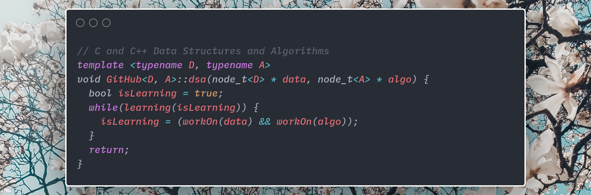

# C and C++ Data Structures and Algorithms

## Table of contents
* [Overview](#overview)
* [Algorithms](#algorithms)
* [Data Structures](#data-structures)
* [Sorting-Searching](#sorting-searching)

## Overview
This repository is for small C and C++ programs I do outside of my school work. The repository includes data structures and algorithms that I have done for practice. Expand the sections below to learn more about each program. Feel free to fork this repository and work through some of the data structures and algorithms yourself. I will give comments on your work if you submit a pull request!

## Algorithms

#### C programs
Click to expand the 9 *C programs*!

  
Expand C Programs

  - addingFormattedNums.c
    - print two rows one increasing one decreasing
  - compareArr.c
    - Return -1 if an element of array1 is less than array2, return 1 if an element of array1 is greater than array2, return 0 otherwise
  - factorial.c
    - recursive factorial in c, bad use of recursion but still fun
  - loopPointers
  - randNum.c
    - seeding random numbers
  - reverse.c
    - reverse an array in place
  - reverseStr.c
    - reverse string
  - squareCalc.c
    - return the square of a number with just addition
    - inductive assert
  - textAnim.c
    - terminal text animation

#### C++ Programs
Click to expand the 48 *C++ programs*!

  
Expand C++ Programs

  - **macm-formulas**
    - forumlas used in MACM *including:*
      - combinations
      - permutations
      - combinations with repetition
      - dearangements
  - anagramCheck.cpp
    - determine two words are anagrams for eachother
    - Leetcode problem [here](https://leetcode.com/problems/valid-anagram/)
  - GKSRoundAq1.cpp
    - my solution for Google Kick Start round A, question 1
  - GKSRoundAq2.cpp
    - my solution for Google Kick Start round A, question 2
  - GKSRoundCq1.cpp
    - my solution for Google Kick Start round C, question 1
  - barPblm.cpp
    - algorithm practice
  - barPblm2.cpp
    - more direct solution
  - binaryLLtoInt.cpp
    - Given head which is a reference node to a singly-linked list. The value of each node in the linked list is either 0 or 1. The linked list holds the binary representation of a number.
    - Leetcode problem [here](https://leetcode.com/problems/convert-binary-number-in-a-linked-list-to-integer/)
  - bracketCheck.cpp
    - check for valid brackets using a stack
  - bstFromPreorder.cpp
    - Return the root node of a binary search tree that matches the given preorder traversal.
    - Leetcode problem [here](https://leetcode.com/problems/construct-binary-search-tree-from-preorder-traversal/)
  - calcE.cpp
    - calculate Eulers number using a taylor series
  - climbingStairs.cpp
    - You are climbing a stair case. It takes n steps to reach to the top. Each time you can either climb 1 or 2 steps. In how many distinct ways can you climb to the top?
    - Memoized recursive solution
    - Leetcode problem [here](https://leetcode.com/explore/learn/card/recursion-i/255/recursion-memoization/1662/)
  - employee.cpp
    - class practice
  - definedAsBad.cpp
    - a program rewritten with #Define
  - destinationCity.cpp
    - You are given the array paths, where paths[i] = [cityAi, cityBi] means there exists a direct path going from cityAi to cityBi. Return the destination city, that is, the city without any path outgoing to another city.
    - Leetcode problem [here](https://leetcode.com/problems/destination-city/)
  - fibonacci.cpp
    - six ways of making the fibonacci sequence
    - naive recursive, two memoized recursive, two sequential, one constant
  - flippingAnImage.cpp
    - Given a binary matrix A, we want to flip the image horizontally, then invert it, and return the resulting image.
    - Leetcode problem [here](https://leetcode.com/problems/flipping-an-image/)
  - getMinimum.cpp
    - recursively return the minimum element of a vector
    - generic programming using templates
  - increasingOrderSearchTree.cpp
    - Given a binary search tree, rearrange the tree in in-order so that the leftmost node in the tree is now the root of the tree, and every node has no left child and only 1 right child.
    - Leetcode problem [here](https://leetcode.com/problems/increasing-order-search-tree/)
  - kWeakestRows.cpp
    - Given a m * n matrix mat of ones (representing soldiers) and zeros (representing civilians), return the indexes of the k weakest rows in the matrix ordered from the weakest to the strongest.
  - macmFindNum.cpp
    - find a number such that abc = a! + b! + c!
  - maxDepthBinaryTree.cpp
    - Given a binary tree, find its maximum depth. The maximum depth is the number of nodes along the longest path from the root node down to the farthest leaf node.
    - Leetcode problem found [here](https://leetcode.com/explore/learn/card/recursion-i/256/complexity-analysis/2375/)
  - maxProductInArr.cpp
    - Given the array of integers nums, you will choose two different indices i and j of that array. Return the maximum value of (nums[i]-1)\*(nums[j]-1).
    - Leetcode problem found [here](https://leetcode.com/problems/maximum-product-of-two-elements-in-an-array/)
  - mergeTwoBinaryTrees.cpp
    - Given two binary trees and imagine that when you put one of them to cover the other, some nodes of the two trees are overlapped while the others are not. You need to merge them into a new binary tree. The merge rule is that if two nodes overlap, then sum node values up as the new value of the merged node. Otherwise, the NOT null node will be used as the node of new tree.
    - Leetcode problem found [here](https://leetcode.com/problems/merge-two-binary-trees/)
  - mergeTwoSortedLists.cpp
    - Merge two sorted linked lists and return it as a new sorted list. The new list should be made by splicing together the nodes of the first two lists.
    - Leetcode problem found [here](https://leetcode.com/explore/learn/card/recursion-i/253/conclusion/2382/)
  - miniMaxSum.cpp
    - HackerRank problem found [here](https://www.hackerrank.com/challenges/mini-max-sum/problem)
  - multiplyWithAdd.cpp
    - multiplication using only addition
  - nAryPreorderTreeTraversal.cpp
    - Given an n-ary tree, return the preorder traversal of its nodes' values.
    - Leetcode problem found [here](https://leetcode.com/problems/n-ary-tree-preorder-traversal/)
  - nAryPreorderTreeTraversal.cpp
    - Given an n-ary tree, return the postorder traversal of its nodes' values.
    - Leetcode problem found [here](https://leetcode.com/problems/n-ary-tree-postorder-traversal/)
  - nonDecreasingArray.cpp
    - Given an array nums with n integers, your task is to check if it could become non-decreasing by modifying at most 1 element. We define an array is non-decreasing if nums[i] <= nums[i + 1] holds for every i (0-based) such that (0 <= i <= n - 2).
    - Leetcode problem found [here](https://leetcode.com/problems/non-decreasing-array/)
  - numOfBSTs.cpp
    - number of BST's that can be made with a given number
  - pow.cpp
    - Implement pow(x, n), which calculates x raised to the power n
    - Leetcode problem found [here](https://leetcode.com/explore/learn/card/recursion-i/256/complexity-analysis/2380/)
  - proveEvenNums.cpp
    - induction proof for printing even numbers
  - pyramidImage.cpp
    - Display a pyramid of a given height
  - rangeSumBST.cpp
    - Given the root node of a binary search tree, return the sum of values of all nodes with value between L and R (inclusive).
    - Leetcode problem found [here](https://leetcode.com/problems/range-sum-of-bst/)
  - removeAdjacentDups.cpp
    - Given a string S of lowercase letters, a duplicate removal consists of choosing two adjacent and equal letters, and removing them. We repeatedly make duplicate removals on S until we no longer can.
    - Leetcode problem found [here](https://leetcode.com/problems/remove-all-adjacent-duplicates-in-string/)
  - reverseCharOnly.cpp
    - reverse only the characters in the string
    - Leetcode problem found [here](https://leetcode.com/problems/reverse-only-letters/)
  - reverseStr.cpp
  - reverseStrRecursive.cpp
    - recursively reverse vector
    - Leetcode problem found [here](https://leetcode.com/explore/learn/card/recursion-i/250/principle-of-recursion/1440/)
  - romanToDecimal.cpp
    - given roman numerals, return a decimal number
  - sortArrayByParity.cpp
    - Given an array A of non-negative integers, half of the integers in A are odd, and half of the integers are even. Sort the array so that whenever A[i] is odd, i is odd; and whenever A[i] is even, i is even.
    - Leetcode problem found [here](https://leetcode.com/problems/sort-array-by-parity-ii/)
  - sortedArrayToBST.cpp
    - Given an array where elements are sorted in ascending order, convert it to a height balanced BST. For this problem, a height-balanced binary tree is defined as a binary tree in which the depth of the two subtrees of every node never differ by more than 1.
    - Leetcode problem found [here](https://leetcode.com/problems/convert-sorted-array-to-binary-search-tree/)
  - squareN.cpp
    - Use a generating function to square a number
  - strReverseInP.cpp
    - reverse string in place
  - sumNodesEvenGrandparent.cpp
    - Given a binary tree, return the sum of values of nodes with even-valued grandparent.  (A grandparent of a node is the parent of its parent, if it exists.) If there are no nodes with an even-valued grandparent, return 0.
    - Leetcode problem found [here](https://leetcode.com/problems/sum-of-nodes-with-even-valued-grandparent/)
  - sumOfRootToLeafBinary.cpp
    - You are given the root of a binary tree where each node has a value 0 or 1.  Each root-to-leaf path represents a binary number starting with the most significant bit.  For example, if the path is 0 -> 1 -> 1 -> 0 -> 1, then this could represent 01101 in binary, which is 13.
    - Leetcode problem found [here](https://leetcode.com/problems/sum-of-root-to-leaf-binary-numbers/)
  - toLowerCase.cpp
    - Implement function ToLowerCase() that has a string parameter str, and returns the same string in lowercase.
  - trimBST.cpp
    - Given the root of a binary search tree and the lowest and highest boundaries as low and high, trim the tree so that all its elements lies in [low, high]. Trimming the tree should not change the relative structure of the elements that will remain in the tree (i.e., any node's descendant should remain a descendant). It can be proven that there is a unique answer.
    - Leetcode problem found [here](https://leetcode.com/problems/trim-a-binary-search-tree/)
  - twoSumBST.cpp
    - Given the root of a Binary Search Tree and a target number k, return true if there exist two elements in the BST such that their sum is equal to the given target.
    - Leetcode problem found [here](https://leetcode.com/problems/two-sum-iv-input-is-a-bst/)
  - univaluedBinaryTree.cpp
    - Leetcode problem found [here](https://leetcode.com/problems/univalued-binary-tree/)
  - word2num.cpp
    - given a word (two thousand five hundred and one) a number is returned (2501)

---

## Data Structures

#### C Data Structures
Click to expand the 1 *C data structure*!

  
Expand C Data Structures

  - linkedList.c
    - first implementation of linked list

#### C++ Data Structures
Click to expand the 8 *C++ data structures*!

  
Expand C++ Data Structures

  - **Binary Search Tree**
  	- ***Methods include***
  		- insert
  		- delete
  		- get the minimum value
  		- print inorder
  		- print preorder
  		- print postorder
  		- print in descending order
  		- return the kth smallest number in the tree
  		- return the kth largest number in the tree
  		- search
  		- return BST of lowest common ancestor
  		- return the least depth from the root
  		- print the tree level by level
  - **Singly Linked List**
  	- ***Methods include***
  		- get value at front
  		- get value at back
  		- get the size
  		- get value at index *([])*
  		- append
  		- pop
  		- insert at an index
  		- clear
  		- assign lists *(=)*
  		- concatinate lists *(+)*
  - **Queue**
  	- ***Methods include***
  		- check if empty
  		- get the size of the Queue
  		- get the value at the front
  		- get the value at the back
  		- clear the Queue
  		- push to the back *O(1)*
  		- pop from the front *O(1)*
  		- assign Queue *(=)*
  		- print the Queue
  - **Red Black Binary Tree Hash Table**
    - ***Methods include***
      - assign one tree to another with the overloaded assignment operator *O(n)*
      - insertion *O(log(n))*
      - removal *O(log(n))*
      - search *O(log(n))*
      - search and return a vector of all the values of the keys within two given key values *O(log(n))*
      - return a vector of all the values in ascending order *O(n)*
      - return a vector of all the keys in ascending order *O(n)*
      - return the number of nodes in the tree *O(1)*
      - print the keys and values in ascending order for debugging *O(n)*
  - **Stack**
  	- ***Methods include***
  		- check if empty
  		- get the size of the Stack
  		- get the value at the top
  		- clear the Stack
  		- push to the Stack *O(1)*
  		- pop from the Stack *O(1)*
  		- assign Stack *(=)*
  		- print the Stack
  - **Double Ended Queue**
  	- ***Methods include***
  		- insert at the front
  		- insert at the back
  		- remove from the front
  		- remove from the back
  		- peek at the front
  		- peek at the back
  		- check if it's empty
  		- get the size
  		- copy one Deque into another
  		- deallocate all the Nodes
  		- print the Deque
  		- *Note that this program uses templates so it works for all types :)*
  - **Binary Heap**
    - ***Methods Include***
      - check if empty *O(1)*
      - get the minimum element *O(1)*
      - insert *O(log(n))*
      - delete the minimum element *O(log(n))*
      - make the heap empty *O(1)*
      - *Note that this program uses templates so it works for all types :)*
  - **MinStack.cpp**
    - ***Methods Include***
      - push element onto the stack *O(1)*
      - pop element off the stack *O(n)*
        - *O(n)* because will iterate through all elements if the element popped was the minimum element.
      - get the top element *O(1)*
      - get the minimum element in the stack *O(1)*

---

## Sorting-Searching

#### C Sorting-Searching

Click to expand the 8 *C Sorting-Searching Algorithms*!

  
Expand C Sorting-Searching

  - binarySearch.c
    - first implementation of a binary search (those were the days)
  - binarySearch2.c
    - second implementation of a binary search
  - binarySearchCP.cpp
    - HackerEarth problem found [here](https://www.hackerearth.com/practice/algorithms/searching/binary-search/tutorial/)
  - bubbleSort.c
    - everyone loves bubbles
  - insertionSort.c
    - linearSearch.c
  - mergesort.c
    - first implementation of merge sort
  - quicksort.c
    - first implementaion of quick sort
  - selectionSort.c

#### C++ Sorting-Searching

Click to expand the 4 *C++ Sorting-Searching Algorithms*!

  
Expand C++ Sorting-Searching

  - mergeSort.cpp
  - reverseMerge.cpp
    - sort in descending order  
  - binSearch-mergeSort
    - **Binary Search and Merge Sort**
      - Binary and Merge sort with generics programming
  - quicksort
    - **Quicksort with median-of-three pivot**
      - This Quicksort uses a median-of-three pivot. This means that the pivot is chosen by sorting the first element, the last and the middle element, and taking the median. This method ensures that the worst case O(n^2) becomes exponentially unlikely.
      - An insertion sort is used for subarrays of size 10 or less. This is because the insertion sort is more optimal for very small arrays.

## License
Licensed under the [MIT License](LICENSE).
